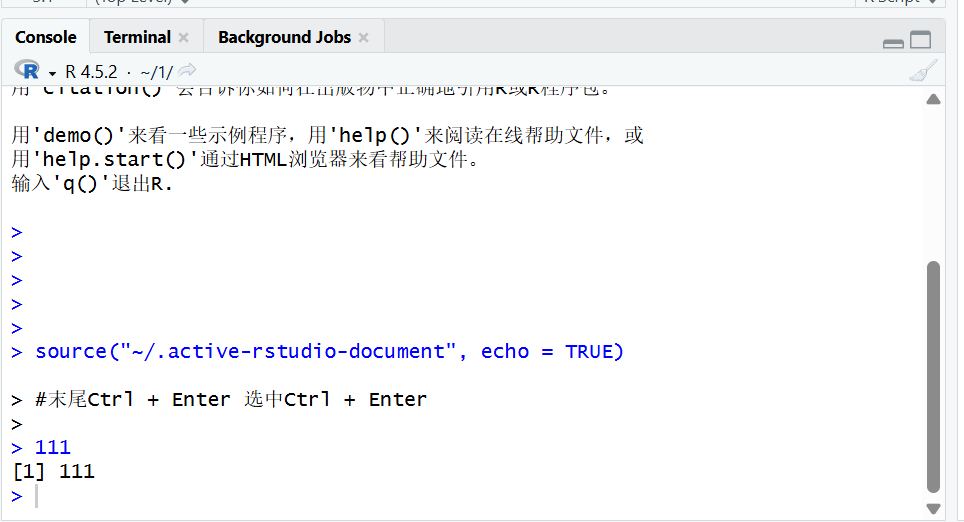
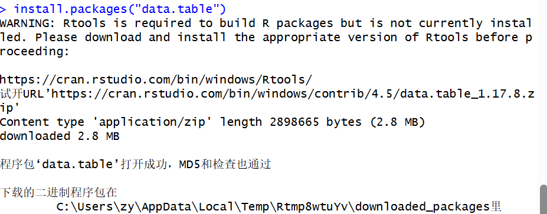
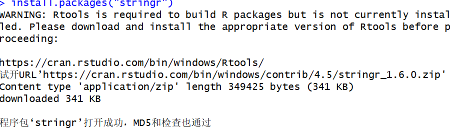
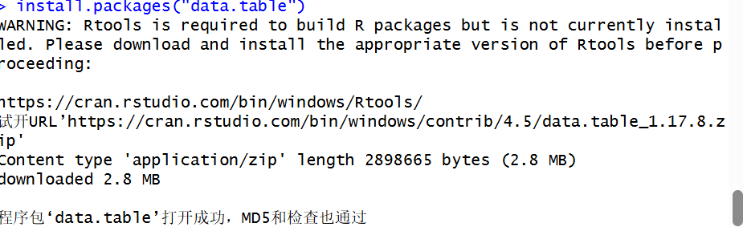
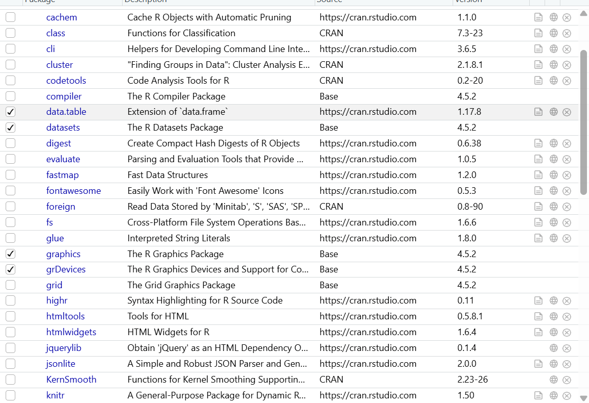
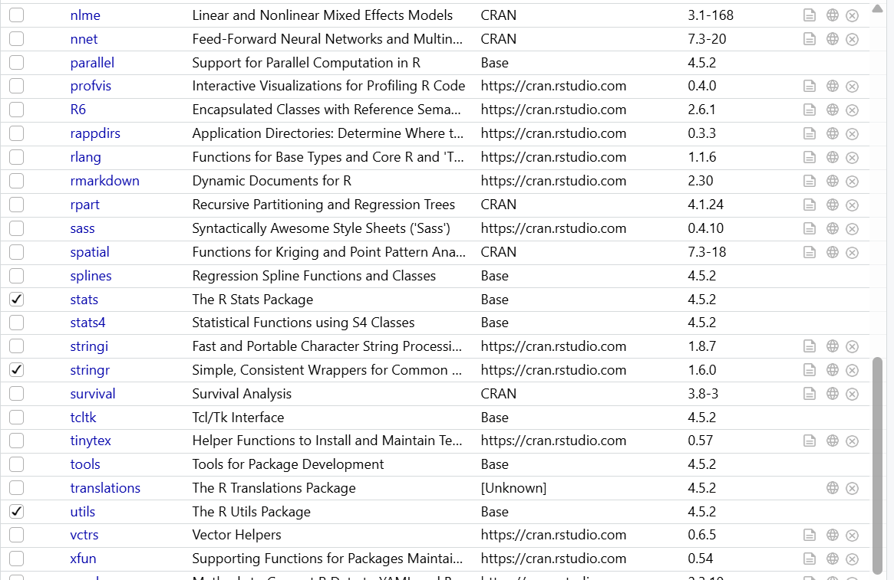
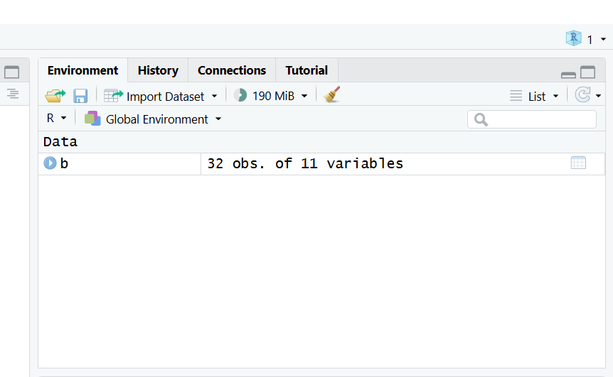

#末尾Ctrl + Enter 选中Ctrl + Enter
#Ctrl + Shift + Enter run
# install.packages("data.table")
# install.packages("stringr")
# library(data.table)
# library(stringr)
#只需安装一次），下次无需重新安装。
#需要重新导入
# b <- mtcars
# <-  'alt'+'-'
#单行注释用 # 开头
# 多行注释用'Ctrl'+'Shift'+'C'
(1).png)

